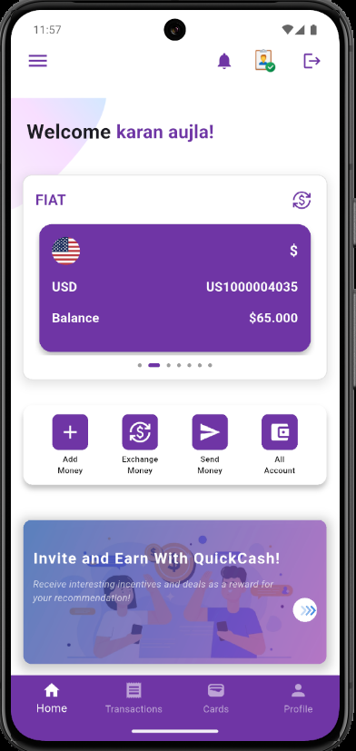

# 💸 QuickCashApp

**QuickCashApp** is a modern fintech solution designed to simplify financial transactions by integrating traditional banking and cryptocurrency in a single, secure app. With features like biometric login, instant money transfers, and seamless crypto trading, QuickCashApp offers users a fast, safe, and convenient experience.

---

## 🚀 Features

- 🔒 **Biometric Login**: Secure and instant login using fingerprint authentication.
- 💵 **Instant Money Transfers**: Send money instantly to saved beneficiaries or new accounts.
- 🏦 **Default Bank Account Management**: Set a preferred account for simplified transactions.
- 🔁 **Crypto to Bank Conversion**: Transfer crypto funds and convert them to preferred currencies.
- 📈 **Crypto Trading**: Buy and sell cryptocurrencies directly from your dashboard.
- 📊 **User Dashboard**: View balances, recent transactions, and quick shortcuts to features.

---

## 📱 Screenshots

<p float="left">
  <npsp>
  <npsp>
  <npsp>
  <npsp>
</p>

---

## 🛠️ Installation Guide

1. **Clone the repository**

```bash
git clone https://github.com/VIKAS-WEB/QuickCashApp.git
cd QuickCashApp
